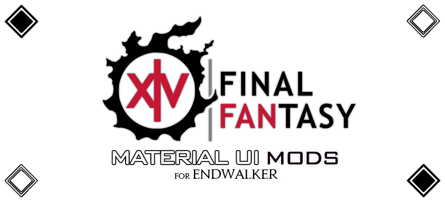

## FFXIV MATERIAL UI Fixes

## CONTENTS
1. [DISCLAIMERS](#disclaimers)
2. [INTRO](#intro)
3. [PREVIEWS](#previews)
4. [INSTALL GUIDE](#install-guide)
5. [CREDIT AND SUPPORT](#credit-and-support)

## DISCLAIMERS
>Using third party tools for FFXIV is against the Square Enix User Agreement, and should be done at your own risk as it __could__ result in an account ban. However, Yoshi-P (the game's producer) has said in interviews that while the official stance on third party tools will always be "no", Square Enix both cannot and do not want to see what is installed on your PC. It is a complicated, grey-zone issue that usually ends in circular arguments and it just never ends.
>
>Some tools, like combat trackers, are abused to harass other players while others have a lewd/illegal nature to them, and so Square Enix must be able to ban accounts who use modding for this purpose.
>
>There are a few rules of thumb when it comes to third party tools.
>* Do not harass people.
>* Do not post your character name visibly in modded screenshots.
>* __DO NOT POST MODDED SCREENSHOTS WITH THE SQUARE ENIX COPYRIGHT INFORMATION VISIBLE__.
>
>Square Enix has a much lower tolerance for nsfw mods and will aggressively take down anything that is not "brand safe"
>
>—
>
><i>The first rule of mods, is don't talk about mods.</i>
>
>Yoshi P interview for more context on this matter: https://www.youtube.com/watch?v=e_i6mjiGerU

## INTRO
Material UI replaces FFXIV's built-in theme (dark-theme)

There are two kinds, the concepts for each theme are as follows:

* **Black**: Targeting modern dark color, Edged UI
* **Discord**: Announcement of the discontinuation of the development of the Discord theme https://github.com/skotlex/ffxiv-material-ui/issues/314

## PREVIEWS
#### MAIN MODS (BLACK)

#### OPTIONS

For more information, check out the discord server [here](https://discord.gg/T5sWUpgNPD)

## INSTALL GUIDE
First, please refer to a separate [GUIDE page](https://github.com/skotlex/ffxiv-material-ui?tab=readme-ov-file#install-guide)\
**Installation methods include `TexTools` and `Penumbra`, and I recommend TexTools since Penumbra UI mods tend to crash Dalamud.**

After installing the main pack, install the pack fixes after it.

## CREDIT AND SUPPORT
This original mod was created by *skotlex* and help of all testers.

If you like his work and want to support it, you can do it [here](https://ko-fi.com/skotlex). Of course, there is no coercion in this sponsorship, and it's just your choice.

